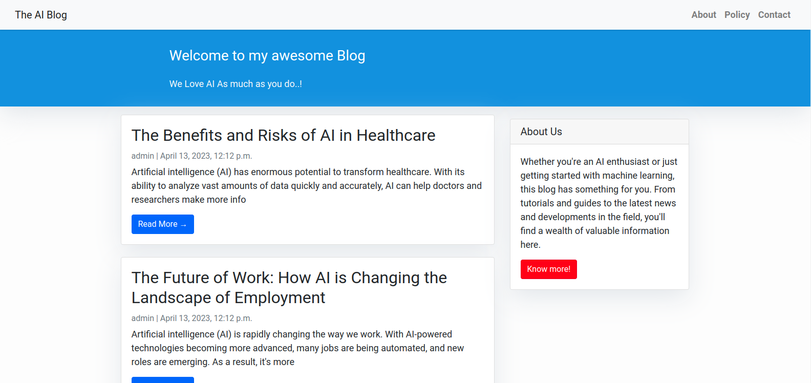
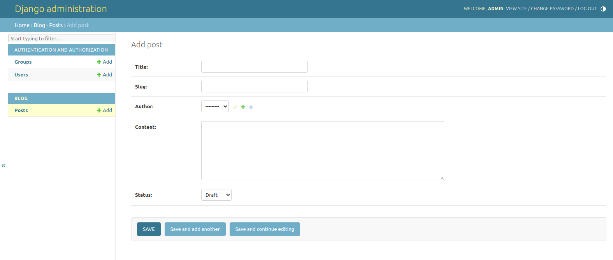
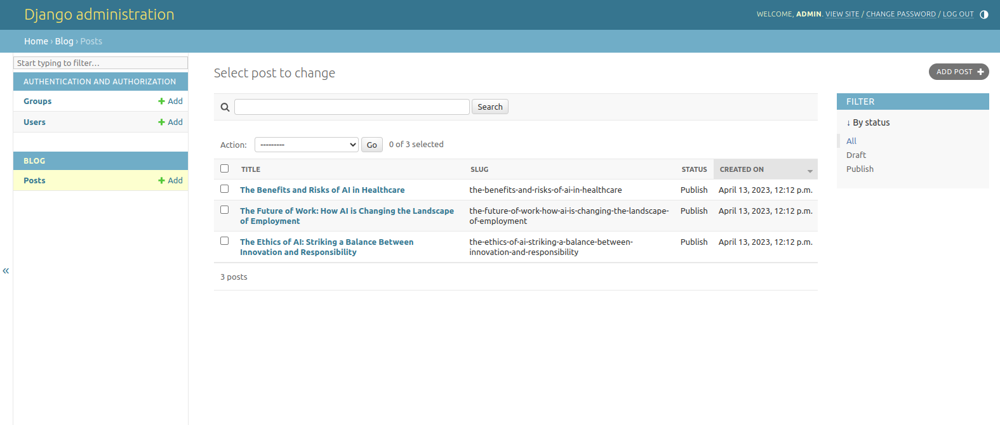
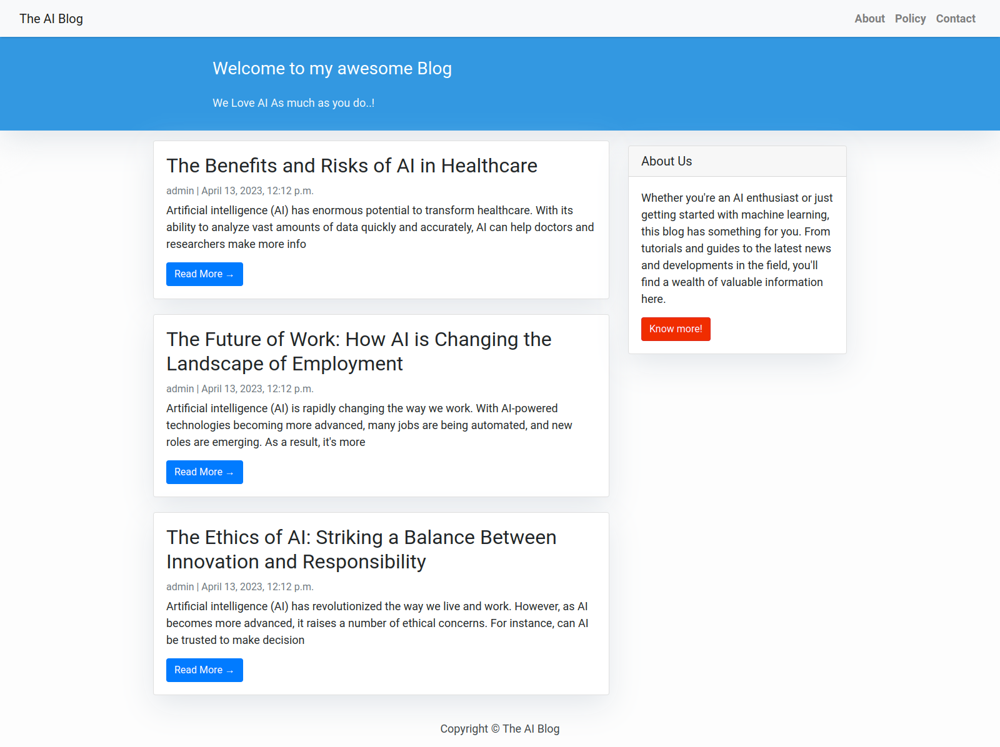
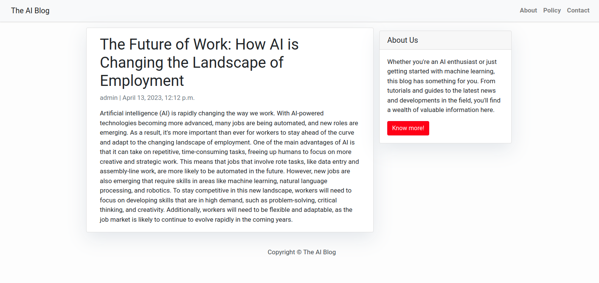

# blog-app-3

- This Django blog app allows users to create posts and publish them on the website.

- The app includes a `Post` model with fields for the post's title, author, content, and status (draft or published).

- The `PostList` and `PostDetail` views allow users to view a list of published posts and view a specific post in detail, respectively.

- The app also includes an admin interface where posts can be managed, filtered, and searched.

- The templates for the app include an `index.html` file for listing all posts, a `post_detail.html` file for displaying individual posts, and a `sidebar.html` file for displaying information about the blog website.

